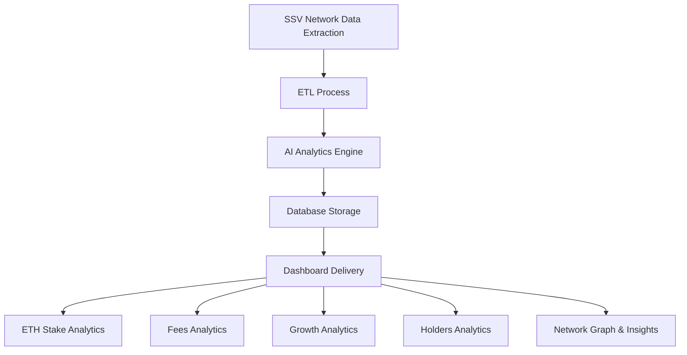

### SSV Pulse: AI-Driven Analytics Platform for the SSV Network

---

#### Overview

Welcome to **SSV Pulse**, an advanced AI-based analytics platform tailored to provide deep insights into the **SSV Network**. By leveraging state-of-the-art **Large Language Models (LLMs)**, SSV Pulse offers a comprehensive view of the network, analyzing key metrics while providing actionable investment strategies, trend predictions, and educational resources for both newcomers and experienced participants. Whether you're a validator, operator, or simply interested in the SSV ecosystem, SSV Pulse equips you with the tools and knowledge to make informed decisions.

---

### Features

#### 1. ETH Stake Analytics

- **Track Staking Trends:** Monitor the amount of **ETH staked** within the SSV network. Analyze key staking participants and their impact on the network's security and rewards.
- **Predictive Insights:** Our AI models forecast future staking activities, identifying growth opportunities and potential security implications.

#### 2. Fees Analytics

- **Fee Distribution Insights:** Analyze how fees are distributed among **validators, operators, and the network**. Understand the profitability of different positions.
- **Optimization Suggestions:** SSV Pulse uses AI to offer strategies for **optimizing fee revenues** and **minimizing operational costs**.

#### 3. Growth Analytics

- **Network Expansion:** Monitor the growth of the **SSV network** over time, tracking new validators, operators, and significant milestones like network upgrades.
- **Forecasting Growth:** Our AI models forecast future growth trajectories, providing insights into the long-term **health and scalability** of the network.

#### 4. Holders Analytics

- **Token Distribution Insights:** Explore how **SSV tokens** are distributed across wallets, tracking major holders and their behaviors.
- **AI-Driven Predictions:** Identify accumulation and distribution patterns, enabling **strategic investment** based on holder movements and market trends.

#### 5. Network Graph, Insights & Connections

- **Visualize Relationships:** SSV Pulse offers an interactive network graph that shows connections between **validators, operators, and accounts**.
- **AI-Driven Insights:** Gain a unique perspective into the behaviors of key participants. Our AI suggests opportunities for **collaboration, investment,** and **optimization** based on network connections.

---

### Architecture

**SSV Pulse** is built using a robust, modular architecture that ensures seamless integration of data from the SSV network and reliable delivery of insights. The architecture incorporates key layers for data extraction, processing, AI-powered analytics, and user interface delivery.

- **Data Extraction & ETL Process:** SSV Pulse extracts real-time data from the **SSV network** and processes it through the ETL (Extract, Transform, Load) pipeline.
- **AI Analytics Engine:** Our **LLM models** analyze the processed data to provide actionable insights and predictions.
- **Database Storage:** All data is securely stored, ensuring availability for real-time analytics.
- **Dashboard Delivery:** Insights are delivered to the user through an intuitive, interactive dashboard that covers all the key features, including staking, fees, growth, holders, and network visualizations.

---

### Meeting User Needs

**SSV Pulse** is designed to meet the needs of various stakeholders in the SSV ecosystem:

#### For Validators & Operators:

- **Optimize Strategies:** Use **Fee Analytics** and **ETH Stake Analytics** to optimize staking and fee strategies.
- **Monitor Growth:** Keep track of network expansion, identifying opportunities to scale operations.

#### For Investors:

- **Informed Investment Decisions:** Use **Holders Analytics** and **Growth Analytics** to evaluate the long-term health of the network and make informed investments.
- **Predicted Market Trends:** Our AI models predict token movements and offer investment suggestions based on real-time data.

#### For New Users & Enthusiasts:

- **Education & Innovation:** SSV Pulse provides insights into the **SSV network** that guide new users toward better understanding. The **Network Graph** offers a visual overview, helping new users grasp the complexities of the ecosystem.
- **Drive Innovation:** The platform supports **innovation** by offering data-driven insights that help participants design and deploy better solutions.

---

### Conclusion

**SSV Pulse** empowers its users with in-depth analytics and AI-driven insights, providing a clear view of the **SSV network's** health, trends, and opportunities. From validators and operators to investors and new participants, **SSV Pulse** delivers the tools needed to thrive in the SSV ecosystem.

**DATA** - https://thegraph.com/explorer/subgraphs/7V45fKPugp9psQjgrGsfif98gWzCyC6ChN7CW98VyQnr?view=Query&chain=arbitrum-one

**DATA CSV** - https://api.ssv.network/documentation/#/

--- 

This structure mirrors the earlier example, emphasizing key features, architecture, and how the platform benefits various stakeholders while adding the visual flowchart to clarify the platform’s architecture.
